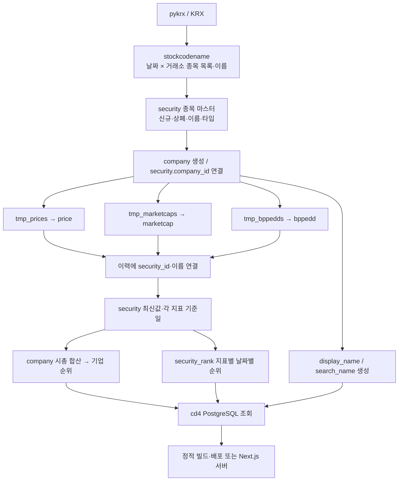

# cd4와 DAG의 데이터 연동 현황

조사 기준: **2026-10-04, Asia/Seoul**. 이 문서는 저장소 코드에서 확인한 현재 구현을 기록한다. 운영 Dagster의 실행 이력, 스케줄 활성화 상태, 배포 환경의 연결 대상, 실제 PostgreSQL DDL과 최신 데이터 날짜는 검증하지 못했다. 아래의 개선 계약과 체크리스트는 향후 작업을 위한 제안이며 구현 완료를 뜻하지 않는다.

기준 커밋은 cd4 `5ceb6c2`(2025-10-04), DAG `afd31f6`(2025-10-05)다. 이 기록 이후 코드가 바뀌면 자산명·설정 키·실제 의존성을 재확인한다.

제품·웹 구현의 전체 현황은 [프로젝트 현황](./project-current-state.md), 라이브러리 업데이트 순서와 검증 기준은 [업그레이드 인계 문서](./upgrade-handoff.md)를 함께 읽는다. DAG를 수정할 때는 해당 저장소의 [AGENTS.md](../../dag/AGENTS.md)와 [코딩 규칙](../../dag/docs/coding.md)을 먼저 확인한다.

## 1. 담당 범위와 이름

cd4는 한국 주식의 숫자와 순위를 빠르게 보여주는 웹 서비스다. 주식 데이터 수집·정제·집계는 별도 저장소 `silla/dag`의 **CD(Chundan)** 영역에서 수행한다. **IS(Isshoo)**는 커뮤니티 게시글 수집, 트렌드·클러스터·AI 후처리 경로이며 cd4 주식 파이프라인의 이름이 아니다.

| 대상 | 책임 | 주된 근거 |
| --- | --- | --- |
| DAG / CD | pykrx 수집, 종목·기업 연결, 이력 적재, 최신값·순위 계산, 로고 처리 | [CD 모듈 등록](../../dag/dag/definitions.py), [CD 설명](../../dag/docs/cd.md) |
| cd4 | PostgreSQL 조회, 순위·상세 화면, 차트, 검색, SEO, 정적 빌드 또는 서버 제공 | [DB 연결](../db/index.ts), [조회 계층](../lib/data/security.ts), [기업 조회](../lib/data/company.ts) |
| DAG / IS | 커뮤니티 게시글·트렌드 처리 | [IS 설명](../../dag/docs/is.md) |

**2026-10-06 cd4 DB 기준 갱신:** cd4는 PostgreSQL 전용이며 `postgres` + `drizzle-orm/postgres-js`, `db/schema-postgres.ts`, PostgreSQL migration history를 사용한다. cd4의 Turso 스키마·libSQL 의존성과 기존 SQLite migration history는 제거했다. 신규 설치와 기존 DB baseline은 [PostgreSQL 안내](postgresql.md)를 따른다. 이 저장소 정리는 실제 업무 DB를 변경하거나 외부 DAG의 Turso 자산을 제거한 작업이 아니다.

## 2. 현재 데이터 흐름



일별 임시 테이블과 본 이력 테이블은 같은 날짜·거래소의 기존 행을 삭제한 뒤 다시 적재한다. 재처리의 기본 단위는 종목 한 행이 아니라 날짜·거래소 파티션이다. `cd_sync_*_to_security`라는 함수명은 혼동하기 쉽다. 이 단계의 실제 SQL은 **이력 테이블에 `security_id`, `name`, `kor_name`을 연결**하며, `security` 최신 지표를 갱신하는 별도 단계는 `cd_update_price_marketcap_bppedd_to_security`다.

근거: [종목 마스터](../../dag/dag/cd_raw_ingestion.py), [가격 처리](../../dag/dag/cd_price_processing.py), [시총 처리](../../dag/dag/cd_marketcap_processing.py), [BPPEDD 처리](../../dag/dag/cd_bppedd_processing.py), [집계·순위](../../dag/dag/cd_metrics_processing.py).

## 3. 자산과 의존성

아래 표는 PostgreSQL 일별 경로의 **직접 의존성**이다. `P`는 `daily_exchange_category_partition`, `—`는 해당 자산에 `partitions_def`가 선언되지 않았음을 뜻한다. 모든 자산의 그룹은 `CD`다.

| 자산 | 직접 상위 자산 | 파티션 | 결과 |
| --- | --- | --- | --- |
| `cd_stockcode` | 없음 | P | `stockcodename` 티커 목록 |
| `cd_stockcodenames` | `cd_stockcode` | P | `stockcodename.name` |
| `cd_ingest_stockcodenames` | `cd_stockcodenames` | P | `security` 신규·상폐·폐지 취소·이름 변경 |
| `cd_update_securitytypebyname` | `cd_ingest_stockcodenames` | P | `security.type` |
| `cd_upsert_company_by_security` | `cd_update_securitytypebyname` | P | `company`, `security.company_id` |
| `cd_prices` | `cd_upsert_company_by_security` | P | `tmp_prices` |
| `cd_digest_price` | `cd_prices` | P | `price`, 처리한 tmp 정리 |
| `cd_sync_price_to_security` | `cd_digest_price` | P | `price`의 종목 ID·이름 연결 |
| `cd_marketcaps` | `cd_upsert_company_by_security` | P | `tmp_marketcaps` |
| `cd_digest_marketcaps` | `cd_marketcaps` | P | `marketcap`, 처리한 tmp 정리 |
| `cd_sync_marketcaps_to_security` | `cd_digest_marketcaps` | P | `marketcap`의 종목 ID·이름 연결 |
| `cd_bppedds` | `cd_upsert_company_by_security` | P | `tmp_bppedds` |
| `cd_digest_bppedds` | `cd_bppedds` | P | `bppedd`, 처리한 tmp 정리 |
| `cd_sync_bppedds_to_security` | `cd_digest_bppedds` | P | `bppedd`의 종목 ID·이름 연결 |
| `cd_sync_display_name_search_name` | `cd_upsert_company_by_security` | P | `display_name`, `search_name` |
| `cd_post_eng2kor_search_name` | `cd_sync_display_name_search_name` | P | 영문 이름의 한글 발음 검색어 |
| `cd_post_kor2eng_search_name_for_keyboard` | `cd_post_eng2kor_search_name` | P | 영문 키보드 입력 검색어 |
| `cd_update_price_marketcap_bppedd_to_security` | 세 개의 `cd_sync_*_to_security` | — | `security` 최신값·지표별 기준일 |
| `cd_update_marketcap_from_security_to_company` | `cd_update_price_marketcap_bppedd_to_security` | — | `company.marketcap`, `marketcap_date` |
| `cd_update_rank_to_company` | `cd_update_marketcap_from_security_to_company` | — | 기업 시총 순위·이전 순위 |
| `cd_populate_security_ranks` | `cd_update_price_marketcap_bppedd_to_security` | — | `security_rank` |

검색어 분기는 [표시·검색 처리](../../dag/dag/cd_display_processing.py)에서 선언된다. 최신값·기업 합산·기업 순위·종목 순위는 [지표 처리](../../dag/dag/cd_metrics_processing.py)의 각각 109, 9, 293, 383행부터 확인할 수 있다. 특히 종목 순위 자산은 기업 순위 자산에 의존하지 않으므로 두 결과가 동시에 완성됐다는 경계가 따로 필요하다.

### 잡·파티션·스케줄

| 정의 | 코드상 선택·설정 | 해석 및 검증 상태 |
| --- | --- | --- |
| `cd_daily_update_job` | `cd_stockcode`와 downstream, P | PostgreSQL 일별 경로 |
| `cd_daily_update_turso_job` | `cd_stockcode_turso`와 downstream, P | 별도 Turso 경로 |
| `cd_history_job` | `historical_prices`, `historical_marketcaps`, `historical_bppedds`와 downstream | 과거 데이터 별도 적재 |
| `cd_docker_job` | `cd_img_r2_docker`와 downstream | 로고 Docker 크롤러 경로 |
| `cd_node_job` | `cd_img_r2_node`와 downstream | 로고 Node 크롤러 경로 |
| `cd_daily_update_schedule` | `cd_daily_update_job`, `hour_of_day=2`, `minute_of_hour=0` | 일별 파티션의 `Asia/Seoul` 설정에 기반한 새벽 02:00 정의. 실제 활성화·실행은 미검증 |

근거: [잡](../../dag/dag/jobs.py) 6행과 26행 이후, [파티션](../../dag/dag/partitions.py), [스케줄](../../dag/dag/schedules.py) 33행, [등록](../../dag/dag/definitions.py) 203행 이후.

P는 `date`와 `exchange`의 다차원 파티션이다. 거래소는 `KOSPI`, `KOSDAQ`, `KONEX`, 날짜 파티션의 시간대는 `Asia/Seoul`, `end_offset=1`이다. 시작일은 고정 날짜가 아니라 모듈 로딩 시 `datetime.today() - timedelta(days=DAYS)`로 계산되고 현재 `DAYS=90`이다. 따라서 코드 재로딩 시 사용 가능한 과거 파티션 범위가 움직인다. `get_today()`와 과거 수집의 실행일 계산은 별도의 시간대가 없는 호스트 현지 시각을 사용하므로 운영 호스트의 시간대도 확인해야 한다.

현재 등록 코드에서 CD 일별 스케줄 외의 CD 스케줄과 CD 데이터 완료·웹 갱신 센서는 찾지 못했다. IS의 파일 센서·freshness 체크는 CD 완료 체크를 대신하지 않는다. 선언된 의존성 및 `partitions_def`만 조사했으며, Dagster Definitions 로딩이나 실제 실행 계획으로 파티션 매핑을 검증하지 않았다. 특히 파티션 자산과 비파티션 집계 자산 사이의 매핑은 Dagster 업데이트 시 다시 확인한다.

### 과거 적재와 이력 해상도

| 직접 의존성 체인 | 코드상 수집 범위 | 저장·연결 |
| --- | --- | --- |
| `historical_prices` → `digest_historical_prices` → `sync_historical_price_to_security` | 실행일 기준 최근 90일을 날짜별·세 거래소별 수집 | DuckDB `price` → PostgreSQL `price` → 종목 연결 |
| `historical_marketcaps` → `digest_historical_marketcaps` → `sync_historical_marketcap_to_security` | 실행연도에서 `BEFORE_YEARS=21`년을 거슬러 월말 영업일 스냅샷. 최근 약 43일 제외. KONEX는 `20130701`부터 | DuckDB `historical_marketcaps` → PostgreSQL `marketcap` → 종목 연결 |
| `historical_bppedds` → `digest_historical_bppedds` → `sync_historical_bppedd_to_security` | 같은 월말 날짜 정책. KOSPI·KOSDAQ만 수집 | DuckDB `historical_bppedds` → PostgreSQL `bppedd` → 종목 연결 |

근거: [가격 과거 적재](../../dag/dag/cd_history_prices.py) 52·85행, [시총 과거 적재](../../dag/dag/cd_history_marketcaps.py) 18행, [BPPEDD 과거 적재](../../dag/dag/cd_history_bppedds.py) 18행, [상수](../../dag/dag/cd_constants.py). 세 경로는 그룹 `CD_HISTORY`이며 별도의 `partitions_def`가 없다. 이는 현재 [DAG 코딩 규칙](../../dag/docs/coding.md)의 허용 그룹 목록과도 차이가 있으므로 향후 DAG 문서 현행화 대상이다.

주석의 “42일 가격”·“20년”보다 실행 상수 `DAYS=90`, `BEFORE_YEARS=21`을 우선한다. 과거 잡의 종목 연결은 현재 `security`의 상폐되지 않은 종목을 기준으로 하므로 과거 상폐 종목 전체를 복원하는 기능으로 볼 수 없다. 이력 잡이 끝났다고 `security` 최신값이나 기업·종목 순위가 자동으로 재계산되는 직접 의존성도 없다. 일별 적재와 월말 과거 적재가 같은 이력 테이블에 공존할 수 있으며, 실제 DB의 기간별 빈도·누락·보유 기간은 미검증이다. 장기 차트나 기간 평균을 바꿀 때 매일 관측된 20년 데이터라고 가정하지 않는다.

### 외부 DAG의 Turso 경로

다음은 2026-10-04에 조사한 외부 DAG 저장소의 Turso 자산이다. cd4의 지원 DB나 대체 배포 경로를 뜻하지 않는다. 외부 DAG 자산은 별도 모듈로 등록되어 있다. 아래에서 나열한 자산의 직접 의존성은 화살표의 왼쪽이다.

- `cd_stockcode_turso` → `cd_stockcodenames_turso` → `cd_ingest_stockcodenames_turso` → `cd_update_securitytypebyname_turso` → `cd_upsert_company_by_security_turso`.
- 위의 마지막 자산에서 `cd_prices_turso` → `cd_digest_price_turso` → `cd_sync_price_to_security_turso`, `cd_marketcaps_turso` → `cd_digest_marketcaps_turso` → `cd_sync_marketcaps_to_security_turso`, `cd_bppedds_turso` → `cd_digest_bppedds_turso` → `cd_sync_bppedds_to_security_turso`가 분기한다.
- 세 sync를 상위로 하는 `cd_update_price_marketcap_bppedd_to_security_turso` → `cd_update_marketcap_from_security_to_company_turso` → `cd_update_rank_to_company_turso`와 `cd_update_rank_to_security_turso`가 있다. 마지막 두 자산은 같은 기업 합산 자산을 직접 상위로 한다.

종목 마스터와 수집·digest·sync는 P, 지표 처리 네 자산은 비파티션이다. [Turso 지표 처리](../../dag/dag/cd_metrics_processing_turso.py)는 PostgreSQL의 `cd_populate_security_ranks`와 이름·구조가 다르므로 동일한 순위 이력 계약을 제공한다고 가정하지 않는다. [Turso 종목 마스터](../../dag/dag/cd_raw_ingestion_turso.py), [가격](../../dag/dag/cd_price_processing_turso.py), [시총](../../dag/dag/cd_marketcap_processing_turso.py), [BPPEDD](../../dag/dag/cd_bppedd_processing_turso.py)도 별개 코드다. 활성 서비스 확인 전 일괄 삭제하거나 PostgreSQL 구현과 기계적으로 합치지 않는다.

## 4. 웹과 파이프라인 사이의 데이터 계약

### 연결 대상과 스키마

| 항목 | cd4 | DAG / CD | 함께 확인할 사항 |
| --- | --- | --- | --- |
| PostgreSQL 설정 | `DATABASE_URL` 우선, 없으면 `POSTGRES_HOST/PORT/USER/PASSWORD/DB` | `CD_POSTGRES_HOST/PORT/USER/PASSWORD/DB` → `cd_postgres` | 운영 주입값 기준으로 같은 대상인지 확인 |
| 선언 스키마 | `db/schema-postgres.ts` | 각 자산의 SQL, 기존 `docs/cd.md` 설명 | 실제 DDL·제약·인덱스를 대조 |
| 식별자 | Drizzle은 `company_id`, `security_id`를 `text`로 선언 | 생성 시 UUID 문자열 사용. DAG 문서는 UUID 타입으로 설명 | 실제 DB 타입 미검증. Drizzle 선언을 운영 DDL이라고 단정 금지 |
| 날짜 타입 | 이력·최신값 날짜는 `timestamp` → JS `Date`; `security_rank.rank_date`는 `date` | 파티션 일자를 ISO 자정 등으로 변환해 적재 | 날짜의 의미와 시간대·직렬화 규칙 유지 |
| 수치 타입 | 시총·주식수 등 `bigint`를 JS `number`, 지표·순위값은 `doublePrecision` | 수집값을 SQL로 적재·집계 | 큰 합계의 JS 안전 정수 범위·반올림 정책 검증 |

근거: [cd4 연결](../db/index.ts), [cd4 스키마](../db/schema-postgres.ts), [DAG 리소스 연결](../../dag/dag/definitions.py) 236행, [DAG PostgreSQL 리소스](../../dag/dag/resources.py).

값을 출력하지 않는 로컬 문자열 비교 결과, cd4 `.env`의 `POSTGRES_HOST`·`POSTGRES_DB`와 DAG의 `.env`, `.env.dev`, `.env.prod` 각각의 `CD_POSTGRES_HOST`·`CD_POSTGRES_DB`가 모두 달랐다. cd4 로컬 `.env`에는 `DATABASE_URL`이 없었다. **이는 로컬 파일 비교 결과이며 실제 운영 DB가 서로 다르다는 증거는 아니다.** GitHub Secrets, Dagster 배포 환경, 별도 환경 주입 및 연결 가능 여부를 확인해야 한다. 호스트, DB명, 계정, 비밀번호와 연결 문자열은 이 문서에 기록하지 않는다.

### 종목·기업 식별

원천 데이터의 논리 식별자는 **`exchange + 6자리 ticker`**, 마스터·이력·순위 연결은 `security_id`, 기업 합산은 `company_id`다. 마스터 수집은 티커를 6자리 문자열로 맞추며 `(ticker, exchange)`로 기존 종목과 비교한다. `listing_date`는 신규 종목을 발견한 처리일에 설정하므로 원천의 실제 최초 상장일을 별도로 검증한 값이라고 볼 수 없다.

기업 연결은 이름에서 우선주·전환주 접미사를 제거하는 정규식과 이름 매칭에 기반한다. `company_id IS NULL`, 상폐되지 않은 종목만 연결 대상으로 삼고 스팩·리츠·펀드는 제외한다. 이미 연결된 종목의 기업 관계를 이름 변경 후 자동으로 재검증하는 별도 계약은 보이지 않는다. 기업 합산은 법적 기업 식별자가 직접 공급되는 데이터라는 가정보다 현재 이름 기반 연결 규칙을 전제로 검토해야 한다.

cd4 URL/코드 해석은 `market.ticker`를 받지만 [종목 조회](../lib/data/security.ts) 338행 이후의 `getSecurityByCode`는 파싱한 티커만으로 `findFirst`하며 거래소 조건을 넣지 않는다. 현재 코드의 URL 식별 방식과 조회 조건에 차이가 있다. 동일 티커의 거래소 충돌이 실제로 발생하는지는 미검증이다.

### 값과 단위

현재 수집 코드는 pykrx 값을 받아 저장하며 시총을 억·조 단위로 축소해서 저장하지 않는다. 단위 축약은 웹 표시 책임이다.

| 값 | 현재 표시·사용 단위 | 변경 시 주의 |
| --- | --- | --- |
| `price`, OHLC | 원 | `security.price`는 최신 `price.close`에서 옮김 |
| `marketcap`, 거래대금 | 원 | 기업 합산도 원 단위. 억·조 표시는 포맷 단계 |
| `shares`, `volume` | 주식 수·거래량 수치 | 금액 지표와 구분 |
| `bps`, `eps`, `dps` | 원/주 | 화면은 원으로 표시 |
| `per`, `pbr` | 배수 | 화면은 배로 표시 |
| `div`, 가격 등락률 `rate` | 퍼센트 수치 | 웹 퍼센트 포맷은 숫자를 그대로 `%`와 표시. 임의로 100을 곱하거나 나누지 않음 |
| 순위 | 1부터 시작하는 정수 | 원천 지표값·순위값·기간 변화를 구분 |

근거: [수집·적재](../../dag/dag/cd_price_processing.py), [지표 수집](../../dag/dag/cd_bppedd_processing.py), [웹 포맷](../lib/utils.ts), [PER 표시](../components/key-metrics-section-per.tsx), [BPS 표시](../components/key-metrics-section-bps.tsx). 이는 코드가 현재 기대하는 단위이며 운영 데이터 표본으로 재검증하지 않았다.

### 날짜와 최신값

`cd_update_price_marketcap_bppedd_to_security`는 상폐되지 않은 세 거래소의 각 종목에 대해 `price`, `marketcap`, `bppedd`를 각각 `date DESC LIMIT 1`로 조회한다. 따라서 최신 가격일, 최신 시총일, 최신 재무지표일이 서로 다를 수 있다. `shares_date`는 시총일을 사용하고 BPS/PER/PBR/EPS/DIV/DPS 날짜는 해당 BPPEDD 행의 날짜를 공유한다. 실행일 메타데이터와 원천 기준일은 별개다.

KONEX의 BPPEDD 수집·digest·sync는 명시적으로 제외된다. 정상적인 데이터 없음과 수집 실패·누락을 구분해야 한다. 가격·시총 digest는 검사 컬럼이 모두 0인 행만 있는 경우 tmp를 정리하고 결과 없이 완료하며, 정상 행과 전부 0인 행이 섞인 경우 오류를 발생시킨다. BPPEDD digest는 SQL에서 `bps/pbr/eps/div/dps`가 모두 0인 행을 제외하며 **PER은 이 검사에 포함하지 않는다**. 기존 [DAG CD 문서](../../dag/docs/cd.md)의 모든 digest를 같은 검사로 설명한 부분과 차이가 있다.

빈 데이터·휴장일 건너뜀도 Dagster materialization 결과로 반환될 수 있다. 자산 성공만으로 새로운 거래일 데이터가 완성됐다고 판단하지 않는다.

### 순위 정책

| 범위 | 현재 계산 방식 | 의미·위험 |
| --- | --- | --- |
| 기업 시총 | 회사 타입 `상장법인`, 해당 거래소 종목 합계가 양수 | 합산 SQL에 상폐 제외와 동일 `marketcap_date` 필터가 없음 |
| 기업 순위 | 시총 내림차순 `ROW_NUMBER()` | 순위가 바뀐 기업만 이전 순위를 덮어씀. `marketcap_prior_rank`는 직전 거래일이 아닌 직전 순위 변경 이전 값일 수 있음 |
| 종목 순위 날짜 | 상폐되지 않은 대상 거래소의 `MAX(security.marketcap_date)` | 모든 지표의 공통 `processing_rank_date`로 사용 |
| 종목 순위 대상 | 상폐 제외, 지표값 `NOT NULL`, 해당 지표 기준일이 공통 처리일과 같은 종목 | 최신 BPPEDD 날짜가 시총일과 다르면 그 지표의 새 순위가 적재되지 않을 수 있음 |
| 정렬 | 시총·BPS·EPS·DIV·DPS 내림차순, PER·PBR 오름차순 | 0·음수 제외 조건 없음. 동일 값의 2차 정렬키도 없음 |
| 순위 이력 | `(security_id, metric_type, rank_date)`로 upsert | 같은 날짜를 재실행하면 덮어씀. `prior_rank`는 그 종목·지표의 더 이른 날짜 중 최신 기록 |
| 웹 목록 | 지표별 `MAX(security_rank.rank_date)` 조회 | 지표마다 최신 공개일이 다를 수 있음 |
| 웹 상세 주변 순위 | PER·PBR은 `security` 최신값 중 양수만 다시 정렬 | DAG의 0·음수 포함 정책 및 기준일·대상 범위와 다름 |

근거: [DAG 집계·순위](../../dag/dag/cd_metrics_processing.py) 47·314·408·448행, [웹 순위 목록](../lib/data/security.ts) 42행, [PER/PBR 주변 순위](../lib/data/security.ts) 835·884행. 기업 합산은 최대 날짜를 모든 합계의 `marketcap_date`로 붙이지만 실제 합산 행들이 그 날짜인지 검사하지 않는다. 값이 같을 때 `ROW_NUMBER()` 결과의 순서도 안정적으로 보장하는 조건이 없다. 순위 변동을 사용자의 전일 변화로 표현하려면 양쪽 정의부터 합의해야 한다.

## 5. R2 로고 경로는 가격 갱신·웹 배포와 별도다

```text
cd_img_r2_docker / cd_img_r2_node
        ↓  (cd_r2_download는 두 자산을 모두 직접 의존성으로 선언)
cd_r2_download → cd_png2webp → cd_img_finalize
        source R2 → 로컬 PNG → WebP → target R2 + company.logo + DuckDB 기록
```

로고 크롤러는 [Node 자산](../../dag/dag/cd_img_r2_node.py) 또는 [Docker 자산](../../dag/dag/cd_img_r2_docker.py)에서 네이버 크롤러를 실행한다. [이미지 후처리](../../dag/dag/cd_img_r2_processing.py)에서 `CD_R2_SOURCE_BUCKET`, `CD_R2_TARGET_BUCKET`, `CD_PUBLIC_URL`을 사용하며 최종 `company.logo`는 PNG 공개 URL이다. WebP도 업로드·기록하지만 DB 로고 URL이 자동으로 WebP로 바뀌지는 않는다. 파일명에서 `company_id`를 추출하고 처리 기록은 DuckDB `cd_logo_updates`에 남긴다.

같은 후처리 코드 247–262행에서는 R2 업로드 오류를 기록한 뒤에도 `company.logo` 갱신을 계속할 수 있다. 객체 업로드 성공과 DB URL 공개가 하나의 성공 조건으로 묶여 있지 않아 없는 이미지를 가리킬 가능성이 있다. 실제 운영에서 이 오류가 발생했는지는 미검증이다.

`cd_r2_clear`, `cd_r2_clear_tgt`는 직접 의존성이 없는 별도 버킷 정리 자산이다. 자동 가격 갱신의 일부로 실행하거나 웹 배포용 R2와 같은 버킷이라고 가정하지 않는다. 이미지 두 크롤러의 자산 의존성과 각 잡의 선택이 운영 실행에서 어떻게 조합되는지도 별도 확인 대상이다.

cd4의 [R2 배포 워크플로](../.github/workflows/deploy-r2.yml)는 `out` 정적 사이트를 `R2_BUCKET_NAME`에 업로드한다. 이는 DAG의 회사 로고 버킷 계약과 다른 설정이다. 실제 버킷 구성은 확인하지 않았으므로 로고·사이트 객체의 분리 여부를 운영 설정에서 확인해야 한다.

## 6. 데이터 완료부터 웹 공개까지의 계약 부재

현재 코드에는 개별 수집·정제·집계의 의존성이 있지만, **하나의 거래일에 모든 대상 거래소·지원 지표가 끝났음을 확정하고 그 결과만 웹에 공개하는 공통 배치 계약**은 찾지 못했다. `MAX(date)`는 최신값 조회 기준이며 완료 신호를 대신하지 않는다. 비파티션 집계가 모든 필요한 거래소 파티션을 기다리는지, 과거 재처리와 동시 실행 시 어떤 데이터를 읽는지는 실행 계획과 실제 이력으로 검증해야 한다.

| 제공 방식 | 현재 코드 | DAG 갱신 후 필요한 일 |
| --- | --- | --- |
| R2 정적 사이트 | `workflow_dispatch`, `NEXT_OUTPUT_MODE=export`, DB를 읽어 빌드하고 `out` 업로드 | 같은 완료 데이터로 재빌드·배포해야 새 숫자가 공개됨 |
| Netlify 정적 사이트 | 수동 워크플로, export 빌드 후 `out` 배포 | 동일한 재빌드·배포 연결 필요 |
| Next.js 서버 | `NEXT_OUTPUT_MODE`가 export가 아니면 `standalone` | 활성 서버 확인 및 DB 조회 캐시 갱신 정책 필요 |

근거: [Next 설정](../next.config.ts), [R2 워크플로](../.github/workflows/deploy-r2.yml), [Netlify 워크플로](../.github/workflows/deploy-netlify.yml), [Netlify 설정](../netlify.toml). 어느 방식이 현재 운영 사이트를 제공하는지는 미검증이다.

주요 기업·종목 순위 조회의 `unstable_cache`에는 tags만 있고 `revalidate`가 없다. 일부 다른 조회에는 `revalidate: 3600`이 있으므로 전체 캐시가 같은 정책이라는 의미는 아니다. cd4의 앱·lib·scripts와 CD 자산·등록·잡·스케줄에서 `revalidateTag`, `revalidatePath`, 웹훅·배포 dispatch 연결을 찾지 못했다. 외부 운영 자동화까지 없다고 단정할 수는 없다.

향후 구현할 때 합의할 최소 계약은 다음과 같다. 이 계약은 현재 구현에 대한 설명이 아닌 **개선안**이다.

1. 거래일·배치 ID·스키마 버전·대상 거래소와 각 지원 지표의 기대 완료 범위를 정의한다. KONEX 재무지표 제외와 휴장일은 명시적인 정상 상태로 기록한다.
2. 원천 적재 → 이력 연결 → 최신값 → 기업 합산·기업 순위 → 종목 순위가 해당 범위에 대해 검증된 후 완료 상태를 확정한다. 기준일 불일치·미연결 종목·예상치 못한 빈 결과를 완료와 구분한다.
3. 웹은 완료한 배치의 기준일·수치를 함께 읽는다. 정적 사이트는 완료 후 한 번 빌드·게시하고, 서버 방식은 완료 후 관련 캐시를 갱신한다. 빌드 중 데이터가 갱신되어 서로 다른 배치가 섞이지 않는 읽기 방식도 정한다.
4. 웹 게시 성공일·데이터 기준일·배치 ID를 기록한다. 실패한 새 배치 때문에 마지막 정상 공개 데이터를 덮어쓰지 않는 정책과 재실행의 중복 방지·순서 역전 방지를 정한다.

## 7. 두 저장소를 함께 바꿀 때의 체크리스트

- [ ] 운영 방식(R2 / Netlify export / standalone)과 환경 주입 경로를 확인하고, 실제 DB 연결 대상이 같은지 비밀값을 출력하지 않고 검증한다.
- [ ] 실제 DDL·enum·인덱스·제약을 cd4 Drizzle 선언과 DAG SQL에 대조한다. ID 타입, `metric_type`, 날짜 타입, 숫자 범위를 함께 확인한다.
- [ ] 신규 지표는 수집값·단위·결측·0·음수·지원 거래소, 최신값 날짜, 순위 날짜·정렬·동률·이전 순위 의미를 먼저 정한다.
- [ ] DAG 수집/tmp/이력/최신값/순위와 cd4 스키마/조회/라우트/표시/차트/SEO를 함께 변경한다. 필요 시 두 저장소의 변경을 같은 배포 단위로 연결한다.
- [ ] `exchange + ticker` 식별과 `security_id/company_id` 매핑을 유지하고, 상폐·종목명 변경·우선주·기업 연결 영향을 확인한다.
- [ ] Dagster 버전 변경 시 Definitions 로딩, 등록된 CD 자산·잡·스케줄, 다차원 파티션과 비파티션 집계 사이 매핑을 실행 없는 검증부터 확인한다.
- [ ] 테스트 데이터로 정상 거래일, 휴장일, 거래소 일부 실패, KONEX 재무지표 제외, 지표 날짜 불일치, 동일 날짜 재처리, 동률·0·음수 정책을 확인한다. 운영 적재·백필은 별도 작업으로 수행한다.
- [ ] 이력 해상도와 순위 기준일을 유지하는지 확인한다. 월말 자료를 일별 장기 이력으로 취급하거나 가중치 없이 기간 평균을 바꾸지 않는다.
- [ ] 모든 대상 거래소·지표의 완료 경계와 웹 게시 계약을 확인한 후 새 배치의 공개 기준일·값을 화면·DB 결과와 대조한다.
- [ ] 로고 변경은 가격 갱신과 분리하여 R2 저장소·공개 URL·파일명 ID·포맷을 검증한다.
- [ ] cd4의 이 문서·프로젝트 현황·업그레이드 인계와 DAG의 `docs/cd.md`를 최종 구현에 맞춰 함께 갱신한다. 조사일, 근거 파일, 검증한 운영 범위와 남은 미검증 항목을 기록한다.

이번 문서화에서는 구현·DB·DAG 파일·스케줄·배포를 변경하지 않았다. 코드와 자산 선언, 로컬 환경 설정의 비밀값 없는 비교를 근거로 정리했으며 실제 최신 데이터·순위의 정확성이나 운영 정상 여부를 확정하지 않는다.
