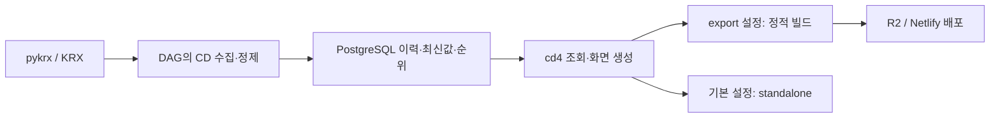

# cd4 프로젝트 현황 — 업데이트 전 조사 기록

## 1. 조사 기준과 범위

| 항목 | 기준 |
| --- | --- |
| 조사일 | 2026-10-04, Asia/Seoul |
| cd4 기준 커밋 | `5ceb6c2` — 커밋일 2025-10-04 |
| DAG 기준 커밋 | `afd31f6` — 커밋일 2025-10-05. 별도 저장소의 기존 사용자 파일은 변경하지 않음 |
| 조사 대상 | cd4 소스·문서·배포 설정, 형제 DAG 저장소의 CD 경로, youtubeknowledge의 Stock Explainer 관련 기록 |
| 작성 목적 | 별도 채팅의 라이브러리 업데이트와 문서 현행화를 위한 출발점 보존 |
| 이번 작업 | 현황 조사와 Markdown 문서화. 앱·라이브러리·DB·파이프라인·배포 구현의 변경은 하지 않음 |

이 문서는 코드 조사 결과다. 운영 사이트의 최신 데이터·광고 노출·유입·수익 또는 Dagster의 최근 성공 실행을 확인한 운영 보고서가 아니다. 후속 작업의 구체적인 버전 기준과 검사 결과는 [업그레이드 인수인계](upgrade-handoff.md), 데이터 계약은 [DAG 연동 계약](dag-integration.md)을 함께 읽는다.

## 2. 사용자 제품 의도와 서비스 경계

**사용자 진술(2026-10-04):** 한국 주식의 시가총액 등 사람들이 궁금해하는 정보를 쉽게 확인하게 하고, 단순한 핵심 기능을 통해 검색 유입과 반복 방문을 만들며 Google AdSense를 수익화 수단으로 활용하려는 서비스다. 추가 기능의 가능성은 있지만 이번 대화에서 확장 기능을 채택하거나 우선순위를 확정하지는 않았다.

여기서 엔트리급은 사용 목적과 진입 부담에 관한 설명이다. 품질이나 데이터 신뢰성을 낮춰도 된다는 의미가 아니다. 현재 구현에 지표·차트가 많더라도 이후 개발의 제품 기준은 궁금한 정보를 빠르게 찾는 경험이다.

**사용자 진술:** Stock Explain MVP는 강한 분석을 기반으로 하는 다른 제품이다. cd4를 그 제품의 축소판이나 필수 유입 화면으로 단정하지 않는다. 제품 통합, 공통 계정·runtime·DB 선행 개발은 이번에 결정되지 않았다.

Knowledge 기록에는 시총 랭킹·히트맵을 Stock Explainer의 탐색 입구 후보로 제안한 과거 논의가 있다. 후보를 채택된 현재 구조로 바꾸지 않으며 이번 사용자 설명을 우선한다. 해당 문서의 상대 경로는 youtubeknowledge 기준 `sources/discussions/whole-asset-platform-direction.md`의 “초기 제안과 후속 합의의 범위”다. 조사 범위에서 cd4·DAGster·AdSense의 직접적인 기존 Wiki 기록은 찾지 못했다.

**Agent assessment:** 홈의 순위 조회, 종목 상세, 최근 본 종목은 사용자가 말한 간단한 조회·반복 방문 목적에 부합한다. 실제 SEO 유입·재방문·수익 가능성이 검증되었다는 판단은 아니다.

## 3. 실제 제품 표면

서비스 설정의 이름은 `천하제일 단타대회`, URL은 `https://www.chundan.xyz`다. 폴더 이름은 cd4지만 README·package 이름·일부 화면 문구에는 CD3가 남아 있다. 설정된 URL이 현재 운영 대상을 증명하지는 않는다. 근거: [site 설정](../config/site.ts), [package.json](../package.json), [종목 페이지](../app/security/[secCode]/page.tsx).

| 영역 | 실제 소스에서 확인한 동작 | 주요 근거 |
| --- | --- | --- |
| 홈 `/` | 기업 시총 순위, 기준일, 모바일 상위 10개·데스크톱 20개, CSV | [홈 페이지](../app/(market)/page.tsx), [표시 상수](../config/constants.ts) |
| 기업 순위 `/marketcaps` | 회사에 연결된 종목들의 합산 시총과 기업 순위 | [기업 조회](../lib/data/company.ts), [순위 페이지](../app/(market)/marketcaps/page.tsx) |
| 종목 순위 `/marketcap` | 개별 종목 시총, 현재/이전 순위와 가격 정보 | [종목 조회](../lib/data/security.ts), [순위 페이지](../app/(market)/marketcap/page.tsx) |
| 지표 순위 | `/per`, `/pbr`, `/eps`, `/bps`, `/div`, `/dps` 및 페이지 번호 경로 | [지표 메뉴](../components/market-nav.tsx), [공통 순위 조회](../lib/data/security.ts) |
| 기업 상세 | `/company/[secCode]`, `/company/[secCode]/marketcap`; 합산 추이·종목 구성 비교 | [기업 상세](../app/company/[secCode]/page.tsx), [기업 시총 상세](../app/company/[secCode]/marketcap/page.tsx) |
| 종목 상세 | `/security/[secCode]` 및 `marketcap/per/pbr/eps/bps/div/dps` 하위 경로 | [종목 상세](../app/security/[secCode]/page.tsx), [지표 탭](../components/company-financial-tabs.tsx) |
| 대시보드 | `/dashboard`에 별도 화면 존재 | [대시보드](../app/dashboard/page.tsx) |
| 반복 방문 | 최근 본 종목 최대 10개와 확인한 지표를 localStorage에 저장 | [최근 종목 저장](../lib/recent-securities.ts), [사이드바](../components/sidebar-manager.tsx) |
| 공유·다운로드 | 상세 공유·링크 복사, 목록·상세에서 사용하는 CSV 컴포넌트 | [공유](../components/share-button.tsx), [CSV](../components/CsvDownloadButton.tsx) |

순위 페이지의 공통 페이지 범위는 첫 페이지 20개, 두 번째부터 100개다. 홈 모바일은 그중 10개만 표시한다. 근거: [페이지 범위 계산](../lib/data/pagination.ts) 4–11행, 홈 128–131행.

회원·관심종목·포트폴리오의 실제 route는 조사에서 발견하지 못했다. 하단 메뉴의 “내정보”는 대시보드에 연결되므로 계정 기능 구현의 근거로 사용하지 않는다.

## 4. 기술 구조와 데이터 책임

| 위치 | 현재 역할 |
| --- | --- |
| [app](../app) | Next.js App Router 페이지·metadata·사이트맵 route |
| [components](../components) | 반응형 목록·표·검색·차트·상세 탐색·공유 |
| [lib/data/company.ts](../lib/data/company.ts) | 기업 목록, 합산 시총, 기업 주변 순위 |
| [lib/data/security.ts](../lib/data/security.ts) | 종목·지표 순위, 이력, 종목 코드 조회, 주변 순위 |
| [lib/data/ranking.ts](../lib/data/ranking.ts) | 지표별 기준일과 순위 조회 보조 함수 |
| [lib/select.ts](../lib/select.ts), [lib/getSearch.ts](../lib/getSearch.ts) | 공통 조회, 정적 생성 대상 코드, 검색 데이터 |
| [db/index.ts](../db/index.ts), [Postgres schema](../db/schema-postgres.ts) | postgres-js·Drizzle를 통한 활성 PostgreSQL 연결과 테이블 정의 |
| [Turso schema](../db/schema-turso.ts) | 남아 있는 별도 정의; 현재 `db/index.ts`의 활성 연결 경로가 아님 |
| 별도 DAG의 CD | 주식 마스터·가격·시총·재무지표 수집/정제, 최신값·합산·순위 계산, 별도 로고 처리 |

앱은 DAG API를 호출하는 구조가 아니라 PostgreSQL의 결과 테이블을 직접 읽는다. 기업 목록은 `company`의 합산값·순위를, 공통 종목 순위는 최신 `security_rank`의 값·순위를, 상세는 `security` 최신값과 `price/marketcap/bppedd` 이력을 소비한다. 서로 다른 조회의 기준일이 자동으로 일치하는 것은 아니다.

UI는 React·Tailwind·Radix/shadcn 계열이며 Recharts·D3·lightweight-charts·Nivo 등 차트 라이브러리가 함께 있다. 선언/lock/설치 버전의 구분은 [업그레이드 인수인계](upgrade-handoff.md)에 보존한다. 문서화만으로 사용하지 않는 라이브러리를 판정하거나 제거하지 않았다.

## 5. 배포와 데이터 공개

그림은 존재하는 코드 경로다. 실제 운영 배포가 어느 경로인지, 동시에 운영하는지는 미확인이다.

- [next.config.ts](../next.config.ts) 4–9행: `NEXT_OUTPUT_MODE=export`일 때 정적 export, 그 외 기본값은 standalone.
- [R2 workflow](../.github/workflows/deploy-r2.yml), [Netlify workflow](../.github/workflows/deploy-netlify.yml): 수동 `workflow_dispatch`, 빌드 전 SSR 사이트맵 routes 제거, DB를 읽어 export한 `out` 배포.
- [Vercel 설정](../vercel.json)과 [안내](../VERCEL_SETUP.md)도 남아 있다. 파일 존재를 현재 운영 호스팅 확정으로 해석하지 않는다.
- 정적 배포에서는 DB 갱신 후 재빌드·배포해야 화면이 바뀐다. 서버 경로에서도 주요 `unstable_cache` 조회에 tags만 있고 TTL·명시적 재검증 호출이 없는 부분을 확인해야 한다.
- CD→cd4 빌드/재검증 트리거와 전체 거래소·지표 갱신 완료 후 공개하는 완료 기준은 조사 범위에서 발견하지 못했다. 자세한 근거와 날짜 계약은 [DAG 연동 계약](dag-integration.md)을 따른다.

홈 metadata와 site 설명에는 “실시간” 표현이 있지만 확인된 CD는 일별 수집이다. 홈의 데이터 안내도 “매일 업데이트”라고 적혀 있다. 현재 설명과 코드의 갱신 주기를 후속 작업에서 맞춰야 한다.

## 6. 확인된 문제와 영향

아래 항목은 **업데이트 이전에 존재하는 문제/위험**이다. 모두 운영에서 재현한 장애라는 뜻은 아니다.

| ID | 관측과 예상 영향 | 근거·확인 수준 |
| --- | --- | --- |
| APP-01 | 활성 검색 결과가 예전 `/corp/marketcap/{한글명}`, `/sec/marketcap/{한글명}`으로 이동한다. 현재 company/security routes와 맞지 않음 | [CommandMenu](../components/command-menu.tsx) 112·131·150행, [활성 헤더](../components/site-header.tsx) 182행. 소스 확인, 운영 클릭 미검증 |
| APP-02 | 하단 검색과 JSON-LD SearchAction이 없는 `/screener`를 가리킴 | [하단 메뉴](../components/bottom-navigation.tsx) 36행, [구조화 데이터](../lib/structured-data.ts) 13행. route 파일 부재 확인 |
| APP-03 | AdSense·GA를 layout에서 import하지만 JSX에서 호출하지 않음. 컴포넌트·ads.txt 존재만으로 연결 완료 아님 | [루트 layout](../app/layout.tsx) 9–10·147–210행, [AdSense](../components/GoogleAdsense.tsx), [ads.txt](../public/ads.txt). 소스 확인, 운영 승인·노출·수익 미검증 |
| APP-04 | DB 갱신과 웹 반영 시점이 분리됨. 정적 사이트의 오래된 데이터와 서버 캐시 갱신 문제가 발생할 수 있음 | [배포 흐름](../.github/workflows/deploy-r2.yml), [기업 캐시](../lib/data/company.ts), [종목 캐시](../lib/data/security.ts). 코드 위험, 운영 갱신 지연 미측정 |
| APP-05 | 모바일 홈은 1–10위만 표시하지만 다음 페이지 offset은 20. 홈에서 두 번째 페이지로 가면 11–20위가 건너뛰어질 수 있음 | 홈 128·184행, [페이지 범위](../lib/data/pagination.ts) 7–10행. 소스 흐름 기반 판단, 브라우저 재현 미실시 |
| APP-06 | `secCode`를 거래소·티커로 분리하지만 첫 종목 조회는 ticker만 사용. 거래소+티커 식별 계약과 구현 차이 | [코드 조회](../lib/data/security.ts) 338–350행. 실제 중복 티커로 발생하는지 미검증 |
| APP-07 | 회사·종목 이미지 경로와 구조화 데이터의 이미지 URL에 별도 규칙이 남음. R2의 `company.logo`와 정합성 확인 필요 | [기업 상세](../app/company/[secCode]/page.tsx) 164행, [종목 상세](../app/security/[secCode]/page.tsx) 78행, [구조화 데이터](../lib/structured-data.ts). 실제 이미지 요청 미검증 |
| APP-08 | 타입 검사가 실패하며 build 설정은 타입·lint 오류를 무시함. 성공한 build만으로 검사 통과를 판단할 수 없음 | [Next 설정](../next.config.ts) 15–21행. 실제 타입 검사 결과는 다음 절과 handoff 참조 |

기업 합산 기준일·상폐 처리, PER/PBR 유효값 범위, 이전 기업순위 의미, 거래소별 부분 갱신의 문제는 [DAG 연동 계약](dag-integration.md)에 별도로 기록했다. 앱만 수정해 양쪽의 계산 정책을 다르게 만들지 않도록 함께 확인한다.

## 7. SEO·광고·반복 사용의 검증 경계

metadata·OpenGraph·canonical, WebSite/Organization/FinancialService/FAQ JSON-LD, robots.txt와 분할 사이트맵의 코드가 존재한다. 서버 사이트맵은 [lib/sitemap/utils.ts](../lib/sitemap/utils.ts), 정적 배포용 사이트맵은 [scripts/generate-sitemap.js](../scripts/generate-sitemap.js)가 담당한다. 두 경로를 구분해야 한다.

구현의 존재와 운영 성과는 별개다. Google 색인·Search Console·검색 유입, 방문자 재방문율, 광고 계정 승인·실제 광고 노출·수익, Core Web Vitals를 이번에 확인하지 않았다. 최근 본 종목 기능이 있다는 사실을 실제 반복 사용의 증거로 바꾸지 않는다.

## 8. 수행한 확인과 남은 운영 확인

| 확인 | 결과·범위 |
| --- | --- |
| 코드·문서·git 조사 | 기준 커밋에서 기능·routes·DB·workflow와 기존 문서 불일치를 확인 |
| 설정 대상 문자열 비교 | cd4 `.env`의 `POSTGRES_*`와 DAG `.env/.env.dev/.env.prod`의 `CD_POSTGRES_*`에서 HOST·DB 값이 다름. 비밀값을 출력·문서화하지 않음. 별칭·환경 주입 때문에 실제 운영 DB 불일치로 단정하지 않음 |
| DB 읽기 전용 조회 | 종목 수·지표 기준일을 조회하려 했으나 sandbox `EPERM`, 네트워크 허용 후 `EHOSTUNREACH`. 쿼리 결과를 얻지 못해 최신일·건수 미확인 |
| 타입 검사 | `./node_modules/.bin/tsc --noEmit --incremental false --pretty false`가 exit 2. layout의 중복 metadataBase, 6개 지표 페이지에서 nullable `latestDate`를 metadata keywords에 넣는 문제, 동적 사이트맵 params의 Promise 형식 불일치. [검사 기준점](upgrade-handoff.md) 참조 |
| 파이프라인·배포·브라우저 | 실행하거나 변경하지 않음. 새 production build와 lint 실행도 하지 않음 |

운영 확인이 남은 항목은 실제 주입되는 DB·스키마, Dagster 스케줄 활성화와 최근 성공 실행, 거래소·지표별 데이터 기준일/행 수, 실제 호스팅과 빌드·배포 주기, 공개 페이지의 숫자·검색·광고·사이트맵이다. 과거 build log나 `.next`의 존재로 이 확인을 대체하지 않는다.

## 9. 후속 작업으로 넘길 기준

사용자가 예정한 순서는 라이브러리 최신화 후 기존 문서 현행화다. [업그레이드 인수인계](upgrade-handoff.md)의 단계와 완료 기준은 그 작업을 돕는 **제안**이며 이미 실행된 변경이 아니다.

후속 작업에서 유지할 제품 기준은 쉬운 조회 경험이고, 함께 확인할 시스템 기준은 `DAG 수집 → 같은 기준일의 계산 완료 → cd4 반영 → 사용자 공개`다. 현재 미확인 항목은 검증 결과가 생겼을 때만 상태를 변경하고, 해결한 문제에는 작업일·변경 근거·검사 결과를 남긴다.
